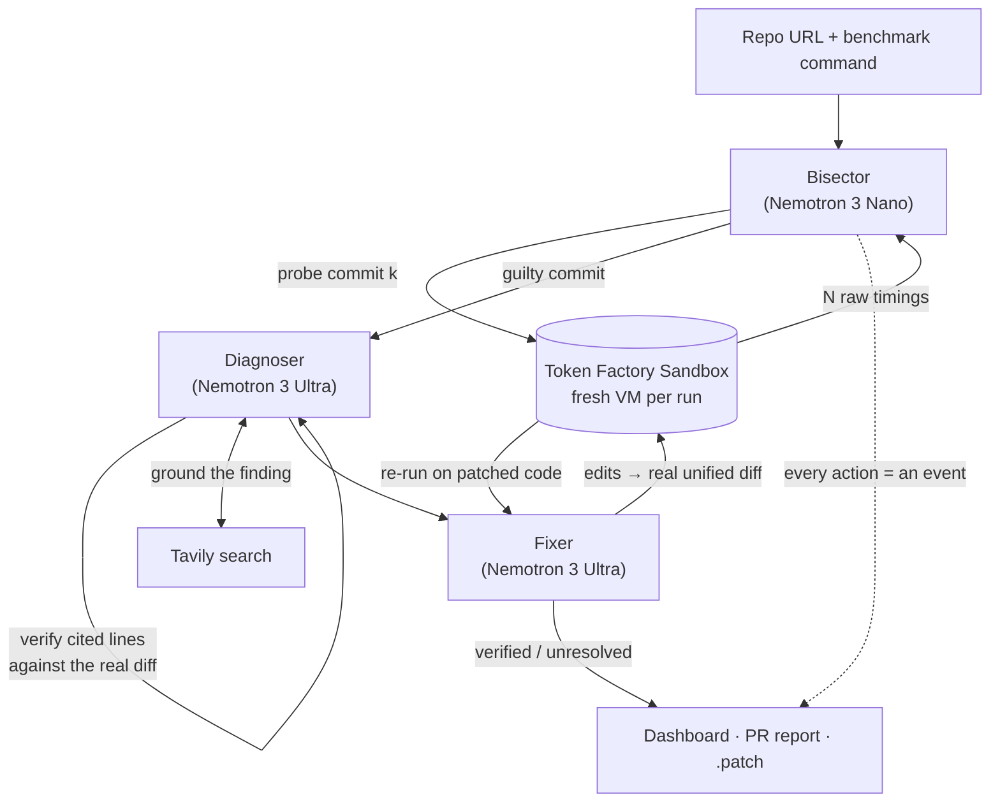

<div align="center">

<picture>
  <source media="(prefers-color-scheme: dark)" srcset="assets/logo/svg/culprit-logo-on-dark.svg">
  <source media="(prefers-color-scheme: light)" srcset="assets/logo/svg/culprit-logo.svg">
  
</picture>

### Finds the exact commit where your benchmark got slower, explains why, and **proves the fix** with a real re-run — showing its work live.

[](LICENSE)
[](https://nebiusglobalaihackathon.devpost.com/)
[](https://nebiusglobalaihackathon.devpost.com/)
[](#how-culprit-uses-nvidia-nemotron-nebius-and-tavily)
[](#how-culprit-uses-nvidia-nemotron-nebius-and-tavily)

**License: [MIT](LICENSE)** · Built for the [Nebius × NVIDIA Global AI Hackathon](https://nebiusglobalaihackathon.devpost.com/) — _Coding & Agentic Engineering_ track

[Quick start](#quick-start) · [How it works](#how-it-works) · [Nemotron & Nebius usage](#how-culprit-uses-nvidia-nemotron-nebius-and-tavily) · [Dashboard](#the-dashboard) · [API](#api-reference) · [Configuration](#configuration) · [Limitations](#known-limitations)

</div>

---

## Table of contents

1. [The problem](#the-problem)
2. [What Culprit does](#what-culprit-does)
3. [How Culprit uses NVIDIA Nemotron, Nebius and Tavily](#how-culprit-uses-nvidia-nemotron-nebius-and-tavily)
4. [How it works](#how-it-works)
5. [The dashboard](#the-dashboard)
6. [Honesty guarantees](#honesty-guarantees)
7. [Quick start](#quick-start)
8. [Running with real Nemotron + Token Factory](#running-with-real-nemotron--token-factory)
9. [Configuration](#configuration)
10. [Using Culprit on your own repository](#using-culprit-on-your-own-repository)
11. [API reference](#api-reference)
12. [Architecture & repository layout](#architecture--repository-layout)
13. [Testing](#testing)
14. [Hackathon submission notes](#hackathon-submission-notes)
15. [Known limitations](#known-limitations)
16. [Security notes](#security-notes)
17. [Contributing](#contributing) · [License](#license)

---

## The problem

Performance regressions hide in innocent-looking commits — _"refactor: simplify order summary loading"_ — and a single one can quietly make a hot path 30× slower. Finding the culprit means hand-running `git bisect` and benchmarking each candidate; fixing it means trusting a guess. Most teams find out when a user complains, and most "AI debugging" demos show you an answer without showing you any evidence.

## What Culprit does

Give Culprit **a repository** and **a benchmark command**. It will:

1. **Bisect** the commit history — every candidate commit benchmarked in a _fresh, isolated_ **Token Factory Sandbox** — to find the exact commit where the benchmark crossed a regression threshold.
2. **Diagnose** the guilty diff with **NVIDIA Nemotron 3 Ultra**, forced to cite the specific lines responsible (each citation is checked against the real diff), and ground the finding with **Tavily** web search.
3. **Fix** it: Nemotron 3 Ultra proposes an exact-text edit, which is turned into a real unified diff.
4. **Prove** it: the benchmark is re-run on the _patched_ code in a sandbox. The fix is called **"verified" only if that re-run actually came back within threshold.**
5. **Stream everything** to a live dashboard — every git call, sandbox run and model request, with raw responses one click away — and export a PR-ready write-up and a real `.patch`.

> The headline claim is the boring one that matters: **a fix is only ever "verified" if a sandbox re-run of the patched code genuinely passed.** Everything in Culprit is built around being able to prove that.

### Example (bundled demo repo)

|               |                                                                                                       |
| ------------- | ----------------------------------------------------------------------------------------------------- |
| Repo          | a 20-commit sample "orders-service" with real git history                                             |
| Guilty commit | `refactor: simplify order summary loading` (one batched query → one query _per order_, a classic N+1) |
| Benchmark     | `python bench.py` — ≈ **297 ms** regressed vs ≈ **10 ms** after the verified fix                      |
| Search cost   | the guilty commit is isolated by benchmarking ~log₂(n) commits instead of all 20                      |

---

## How Culprit uses NVIDIA Nemotron, Nebius and Tavily

This section is the hackathon's required call-out of _where_ each technology is used and _why_.

### NVIDIA Nemotron (open-source models) on Nebius Token Factory

Culprit uses **two Nemotron models, deliberately tiered** — model routing is part of the design, not an afterthought:

| Model                            | Role                                                                                                                                                                                   | Why this model                                                                                                                                    |
| -------------------------------- | -------------------------------------------------------------------------------------------------------------------------------------------------------------------------------------- | ------------------------------------------------------------------------------------------------------------------------------------------------- |
| **Nemotron 3 Nano** (30B-A3B)    | **Bisector control flow.** For every benchmarked commit it returns `clean` / `regressed` / `inconclusive (run more)`, plus how many extra runs to collect.                             | A high-frequency, latency-sensitive judgement — the small, fast model is the right tool. In a typical run **Nano makes ~75% of all model calls.** |
| **Nemotron 3 Ultra** (550B-A55B) | **Reasoning.** Exactly two steps: the **Diagnoser** (root-cause category + cited lines, long diff + file context) and the **Fixer** (exact-text edits, retried with failure feedback). | The only steps that need deep reasoning and a long context window, so the large model is spent only there.                                        |

All inference goes through the **Nebius Token Factory** OpenAI-compatible API (`https://api.tokenfactory.nebius.com/v1`). Token counts shown in the dashboard come from the API's own `usage` block — never estimated.

**Nano is not trusted blindly.** Its verdict is cross-checked against plain median-vs-threshold arithmetic. If they disagree, the arithmetic wins and the override is **shown** in the terminal as an `arithmetic override`.

### Nebius Token Factory Sandboxes

Each candidate commit — and each patched re-run — executes in a **fresh, disposable, VM-isolated sandbox** (via the Token Factory / ConTree sandbox API). That gives:

- **Comparable numbers** — no shared state or cache warmth between benchmark runs.
- **Safety** — untrusted benchmark commands from arbitrary repos never touch your machine.
- **Real measurement** — every number on the chart is a wall-clock result from a real run.

Dependency installs are cached by lockfile hash so many commits don't repeat the same install (`sandbox.deps` events show cache hit/miss).

### Tavily (search grounding)

After a diagnosis, Culprit searches Tavily for the root-cause category plus the cited pattern and attaches sources **with Tavily's own relevance score and snippet**. Results below a relevance floor (`TAVILY_MIN_SCORE`, default `0.2`) are dropped — _if Tavily returns nothing relevant, Culprit doesn't force a citation._ The query, kept sources, scores and the dropped count are all visible in the live terminal.

### Where each technology is in the code

| Technology              | Files                                                           |
| ----------------------- | --------------------------------------------------------------- |
| Nemotron 3 Nano         | `backend/bisector.py`, `backend/models.py`                      |
| Nemotron 3 Ultra        | `backend/diagnoser.py`, `backend/fixer.py`, `backend/models.py` |
| Token Factory Sandboxes | `backend/sandbox_client.py` (`TokenFactorySandbox`)             |
| Tavily                  | `backend/tavily_client.py`                                      |
| Model-catalog preflight | `backend/preflight.py`                                          |

---

## How it works



### 1 · Bisect — find the commit

- **Endpoint confirmation (like `git bisect`)**: the end of the range is benchmarked first. If it isn't regressed, the honest answer — _"no regression in range"_ — costs **1 probe** instead of ~log₂(n). If it is, the search runs over the commits before it.
- **Per-commit measurement**: each probed commit gets a fresh sandbox, `N` benchmark runs (default 5), and the **median** is compared against the baseline (the known-good commit's median).
- **Judgement**: Nemotron 3 Nano returns a verdict; arithmetic cross-checks it; `inconclusive` triggers more runs.
- **Output**: the earliest regressed commit, the full timeline, and every raw run.

### 2 · Diagnose — explain why

- Ultra gets the guilty diff + surrounding file context + commit message + before/after scores.
- It must classify the cause into a constrained taxonomy:

| Category                 | Meaning                                            |
| ------------------------ | -------------------------------------------------- |
| `n_plus_one`             | repeated DB/network calls introduced inside a loop |
| `lost_cache`             | a cache was removed, invalidated or bypassed       |
| `algorithmic_complexity` | complexity increase (e.g. O(n) → O(n²))            |
| `blocking_call`          | new synchronous/blocking operation on a hot path   |
| `allocation_overhead`    | unnecessary allocation or serialization            |
| `other`                  | nothing fits cleanly — explained honestly          |

- **Citation discipline**: every cited line is checked against the real diff (`citation.check` events). A diagnosis whose lines aren't in the diff is retried once, then **downgraded to `other`** rather than shipped.

### 3 · Fix & verify — prove it

- Ultra returns exact-text edits (`file` / `old` / `new`) rather than hand-written diffs (models are unreliable at diff line arithmetic). `patcher.py` converts them into a real unified diff and **rejects any `old` text that doesn't match the file exactly once**.
- The patched code is benchmarked with the **same methodology** as the bisector (same `N`, same statistic).
- Up to **3 attempts**. A failed attempt feeds its result back to the model; a patch that _crashes_ feeds back the traceback and is shown with **no score**, because none was measured.
- Final result is `resolved` only on a real passing re-run; otherwise `unresolved_diagnosis_only` with every attempt listed.

### The live event stream

Every action is emitted as an append-only event **by the code that did the thing, at the moment it did it** — nothing is scripted or replayed. Long operations are spans (`probe.start`/`probe.end`, `model.start`/`model.end`, …) so the terminal can show live spinners. Model-call events carry the exact request (system prompt + payload), the raw response, latency, attempts and API `usage`. See `docs/AGENT_SPECS.md` §5.

---

## The dashboard

A Next.js app designed so someone with no context can understand _what regressed, why, and whether it was fixed_ in about a minute.

| Panel                            | What it shows                                                                                                                                                                                                                                                                                                                                          |
| -------------------------------- | ------------------------------------------------------------------------------------------------------------------------------------------------------------------------------------------------------------------------------------------------------------------------------------------------------------------------------------------------------ |
| **Live terminal**                | Every row is a real event: git calls, sandbox runs landing as bars (colored against the real baseline/threshold), Nemotron requests — expand any one for the exact system prompt, payload and **raw response**. In-flight operations are live spinners with timers. Filter by search / models / sandbox / grounding / fix; download the full `.jsonl`. |
| **Bisect scanner**               | One cell per commit. _Solid_ = measured in a sandbox; _faint_ = ruled out by reasoning only. The window of suspects visibly collapses onto the guilty commit. A cancelled search is never painted "all clean".                                                                                                                                         |
| **Evidence chart**               | Baseline, the regression-threshold band, **every raw run** behind each median, dashed lines across unmeasured gaps, and the verified fix landing back inside the band.                                                                                                                                                                                 |
| **Diagnosis**                    | Category, explanation and cited lines highlighted in the **real diff**; `citation.check` status; Tavily sources with relevance score and snippet.                                                                                                                                                                                                      |
| **Fix**                          | Every attempt, its patch, its measured score (or none, if it crashed) and the verdict.                                                                                                                                                                                                                                                                 |
| **Under the hood**               | Calls, latency and tokens per model, sandbox runs, Tavily searches — summed from the event stream. Shows the Nano/Ultra split.                                                                                                                                                                                                                         |
| **Export**                       | PR-ready write-up (`report.md`) and a real `.patch`. The report can only claim what the job proved.                                                                                                                                                                                                                                                    |
| **History, cancel, persistence** | All jobs and their full event logs are stored in SQLite; cancel stops cleanly at the next checkpoint.                                                                                                                                                                                                                                                  |

Light/dark themes and mobile layouts are supported; empty, failed and cancelled states are first-class.

---

## Honesty guarantees

These are enforced in code (see `AGENTS.md`, rule 1), not just promised:

- Benchmark numbers come **only** from real runs. "Verified" mirrors a real sandbox verdict and nothing else.
- A fix that doesn't resolve the regression is reported as **unresolved**, with all attempts — never dressed up.
- A patch that crashes is a failed attempt with **no score**.
- A diagnosis whose cited lines aren't in the diff is retried once, then downgraded to `other`.
- Tavily results below the relevance floor are dropped, not cited.
- Infrastructure failures fail the job **loudly**; nothing is silently skipped.
- Offline mode (below) is **labelled on every event, job record, page and PR report**, and is never selected implicitly — a missing API key in normal mode is a hard error.

---

## Quick start

### Prerequisites

- **Python 3.11+** and `git`
- **Node.js 20+** and npm (for the dashboard)

### Try it in 60 seconds — no API keys

```bash
# 1. clone
git clone https://github.com/vybex-dev/Culprit.git && cd culprit

# 2. install backend + frontend deps
make install                      # or: see manual steps below

# 3. terminal 1 — backend in offline mode
make dev-backend                  # = cd backend && CULPRIT_OFFLINE=1 python api.py

# 4. terminal 2 — dashboard
make dev-frontend                 # = cd frontend && npm run dev
```

Open **http://localhost:3000** and press **Run the live demo**. In about a minute you'll watch a real git bisection of a 20-commit sample repo: each benchmark run landing as it happens, the search window collapsing onto the guilty commit, a diagnosis with cited lines, and a patch whose fix is verified by a real re-run (~297 ms → ~10 ms).

<details>
<summary>Manual install (without <code>make</code>)</summary>

```bash
cd backend
pip install -r requirements.txt
CULPRIT_OFFLINE=1 python api.py        # serves on http://127.0.0.1:8000

# in another terminal
cd frontend
npm install
cp .env.example .env.local             # NEXT_PUBLIC_API_BASE_URL=http://localhost:8000
npm run dev                            # http://localhost:3000
```

</details>

### What "offline mode" is — and isn't

`CULPRIT_OFFLINE=1` is for development and for letting anyone reproduce the pipeline without keys. **Git, the sandbox subprocesses and every benchmark number are real.** Only the three Nemotron _roles_ (Nano verdict, Ultra diagnose, Ultra fix) and Tavily are replaced by a small deterministic stand-in (`backend/offline.py`) — and the UI says so everywhere. **Submission videos and real evaluations should use live mode.**

---

## Running with real Nemotron + Token Factory

### 1. Get credentials

| Need              | Where                                                                                            |
| ----------------- | ------------------------------------------------------------------------------------------------ |
| `NEBIUS_API_KEY`  | [Nebius Token Factory](https://tokenfactory.nebius.com/) — used for both inference and sandboxes |
| `CONTREE_PROJECT` | a project ID with sandbox access                                                                 |
| `CONTREE_IMAGE`   | an image UUID or `tag:…` containing `python3`, `git` and `pip`                                   |
| `TAVILY_API_KEY`  | [tavily.com](https://tavily.com/)                                                                |

### 2. Configure and start

```bash
cd backend
cp .env.example .env
# edit .env: NEBIUS_API_KEY, CONTREE_PROJECT, CONTREE_IMAGE, TAVILY_API_KEY
# USE_TOKEN_FACTORY=1 is already set in the example
python api.py
```

```bash
cd frontend && npm install && cp .env.example .env.local && npm run dev
```

### 3. Check readiness _before_ spending anything

Open **http://localhost:3000/new**. Its **Backend ready** panel calls `GET /preflight`, which checks — against the **live Token Factory model catalog** — that:

- your Nemotron model IDs exist (and, if not, lists the real Nemotron IDs available to you),
- the API key is accepted,
- the sandbox project and image are set,
- the Tavily key is present.

Misconfiguration shows up _before_ a run, not three minutes into one. This matters because Nebius lists more than one spelling for the Nemotron family — set `NEMOTRON_NANO_MODEL_ID` / `NEMOTRON_ULTRA_MODEL_ID` to whatever preflight reports.

---

## Configuration

All settings are environment variables (read from `backend/.env`; real shell variables win). See [`backend/.env.example`](backend/.env.example).

| Variable                                               | Default                                         | Purpose                                                                |
| ------------------------------------------------------ | ----------------------------------------------- | ---------------------------------------------------------------------- |
| `CULPRIT_OFFLINE`                                      | unset                                           | `1` = no keys needed; real git/benchmarks, labelled stand-in models    |
| `NEBIUS_API_KEY`                                       | —                                               | Token Factory key (inference **and** sandboxes)                        |
| `NEBIUS_API_BASE_URL`                                  | `https://api.tokenfactory.nebius.com/v1`        | inference endpoint                                                     |
| `NEMOTRON_ULTRA_MODEL_ID`                              | `nvidia/nemotron-3-ultra-550b-a55b`             | diagnose + fix model                                                   |
| `NEMOTRON_NANO_MODEL_ID`                               | see `backend/models.py`                         | bisector model — **confirm with `/preflight`**                         |
| `USE_TOKEN_FACTORY`                                    | unset                                           | `1` = run benchmarks in Token Factory Sandboxes; unset = local sandbox |
| `CONTREE_PROJECT`                                      | —                                               | sandbox project ID (`NEBIUS_AI_PROJECT` also accepted)                 |
| `CONTREE_IMAGE`                                        | —                                               | sandbox image UUID or `tag:…` (needs python3 + git + pip)              |
| `CONTREE_URL`                                          | `https://api.tokenfactory.nebius.com/sandboxes` | sandbox API base                                                       |
| `TAVILY_API_KEY`                                       | —                                               | grounding search                                                       |
| `TAVILY_MIN_SCORE`                                     | `0.2`                                           | results scored below this are dropped, never cited                     |
| `REGRESSION_THRESHOLD_PCT`                             | `15`                                            | slowdown vs baseline that counts as "regressed"                        |
| `BENCHMARK_N_RUNS`                                     | `5`                                             | runs per probed commit                                                 |
| `AUTO_RANGE_COMMITS`                                   | `30`                                            | when no range is given, search the last N first-parent commits         |
| `MAX_CONCURRENT_JOBS`                                  | `2`                                             | extra jobs genuinely wait in `queued`                                  |
| `CORS_ALLOWED_ORIGINS`                                 | `http://localhost:3000`                         | comma-separated dashboard origins                                      |
| `HOST` / `PORT`                                        | `127.0.0.1` / `8000`                            | server bind                                                            |
| `CULPRIT_DB`                                           | SQLite at `backend/.data/culprit.db`            | set `memory` for no persistence                                        |
| `CULPRIT_DATA_DIR`                                     | `backend/.data`                                 | where the SQLite DB lives                                              |
| `CULPRIT_ALLOW_LOCAL_REPOS`                            | unset                                           | allow local-path repos while `USE_TOKEN_FACTORY=1`                     |
| `CULPRIT_MAX_DIFF_CHARS` / `CULPRIT_MAX_CONTEXT_CHARS` | `150000` / `300000`                             | caps so one huge diff can't blow the model's context                   |

Frontend: `NEXT_PUBLIC_API_BASE_URL` (default `http://localhost:8000`) in `frontend/.env.local`.

---

## Using Culprit on your own repository

From the dashboard, open **/new**, or call the API directly:

```bash
curl -X POST http://localhost:8000/analyze \
  -H 'Content-Type: application/json' \
  -d '{
        "repo_url": "https://github.com/your-org/your-repo.git",
        "benchmark_command": "python bench.py",
        "commit_range": ["v1.4.0", "main"]
      }'
# → {"job_id": "…"}
```

**Benchmark command requirements**

- Runs from the repository root and finishes in **seconds, not minutes** (isolate the hot path you care about).
- Prints the metric as a number the harness can parse (lower is better — wall-clock time).
- Is deterministic enough that run-to-run noise is smaller than your threshold.

**Commit range** is optional. Ends may be SHAs, tags or branches. Omit it to search the last `AUTO_RANGE_COMMITS` commits.

Then watch `/job/<job_id>`, download `/jobs/<job_id>/report.md` and `/jobs/<job_id>/fix.patch`.

---

## API reference

| Endpoint                            | Description                                                              |
| ----------------------------------- | ------------------------------------------------------------------------ |
| `POST /analyze`                     | `{repo_url, benchmark_command, commit_range?}` → `{job_id}`              |
| `POST /demo`                        | start a job on the bundled sample repo                                   |
| `GET /jobs`                         | job history                                                              |
| `GET /jobs/{id}`                    | full job state (+ derived `metrics`)                                     |
| `GET /jobs/{id}/events?after=<seq>` | live, cursor-paged event stream → `{events, next, done, status}`         |
| `POST /jobs/{id}/cancel`            | cooperative cancel (checked between probes, run rounds and fix attempts) |
| `GET /jobs/{id}/report.md`          | PR-ready write-up                                                        |
| `GET /jobs/{id}/fix.patch`          | the verified (or attempted) patch                                        |
| `GET /config`                       | current mode (live / offline)                                            |
| `GET /preflight`                    | readiness checks against the live model catalog                          |
| `GET /health`                       | liveness                                                                 |

**Job statuses:** `queued → bisecting → diagnosing → fixing → done`, or `failed` / `cancelled`.
**Final results:** `resolved` · `unresolved_diagnosis_only` · no regression in range.

Wire models live in `backend/schema.py`; the event vocabulary and agent JSON contracts are documented in [`docs/AGENT_SPECS.md`](docs/AGENT_SPECS.md).

---

## Architecture & repository layout

```
                ┌────────────────────────── dashboard (Next.js) ──────────────────────────┐
                │  scanner · evidence chart · live terminal · diagnosis · export · history │
                └───────────▲───────────────────────────────▲──────────────────────────────┘
              GET /jobs/{id} (state)            GET /jobs/{id}/events?after=seq (live stream)
                ┌───────────┴───────────────────────────────┴──────────────┐
                │  api.py — FastAPI · job runtime · SQLite · cancel · limits│
                └───┬───────────────────────────────────────────────────┬───┘
                    │ events.py: every action → append-only event       │
     ┌──────────────┼───────────────┬──────────────────┬────────────────┘
     ▼              ▼               ▼                  ▼
 bisector.py    diagnoser.py     fixer.py         sandbox_client.py
 Nano per       Ultra + citation Ultra edits →    Token Factory VM ─ or ─
 commit,        check + Tavily   patcher.py →     local git worktree
 log₂(n) probes                  real re-run
```

```
backend/
  api.py            FastAPI app, job runtime, SQLite-backed history
  schema.py         wire models + SQLite stores
  events.py         append-only live event stream
  bisector.py       binary search; Nemotron 3 Nano verdicts + arithmetic cross-check
  diagnoser.py      Nemotron 3 Ultra root cause + citation verification + Tavily grounding
  fixer.py          Nemotron 3 Ultra edits + sandboxed verification loop (≤3 attempts)
  patcher.py        exact-text edits → real unified diff
  sandbox_client.py Token Factory sandbox + local git-worktree sandbox (same contract)
  models.py         Nebius Token Factory / Nemotron client (retries, usage accounting)
  tavily_client.py  Tavily REST client with relevance floor
  preflight.py      readiness checks against the live model catalog
  report.py         PR-ready markdown write-up
  offline.py        labelled deterministic stand-in for the model roles
  demo_repo.py      builds the bundled sample git repo
  tests/            pytest suite (real git repos, real sandbox subprocesses)
frontend/
  src/app/          pages: / · /new · /jobs · /job/[jobId]
  src/components/   dashboard panels (scanner, chart, terminal, diagnosis, fix, export …)
  src/lib/          terminal.ts + scanner.ts (pure, tested), polling hooks, types
  tests/            unit tests over a real captured job + event stream
docs/               PRD · TRD · AGENT_SPECS · PROJECT_PLAN · SUBMISSION · build-prompts/
demo_cases/         real-OSS ground-truth case notes (templates — see limitations)
assets/logo/        logo, mark, favicons
```

**Tech stack:** Python · FastAPI · httpx · Pydantic · SQLite · structlog — Next.js 16 · React 19 · Tailwind CSS 4 · TypeScript.

---

## Testing

```bash
make test               # everything
make test-backend       # cd backend && python -m pytest -q
make test-frontend      # npm test + typecheck + lint
make check              # tests + production build
```

- The backend suite exercises **real git repositories and real sandbox subprocesses**; only the model roles are faked. The Token Factory HTTP surface (sandbox API, Nemotron calls, preflight) is covered with mocked HTTP.
- Frontend unit tests run against a **job and event stream captured from the real pipeline** (`frontend/tests/fixtures/`), so they fail if the backend's real output drifts from what the UI expects.

---

## Hackathon submission notes

**Event:** [Nebius × NVIDIA Global AI Hackathon](https://nebiusglobalaihackathon.devpost.com/) · **Track:** Coding & Agentic Engineering

| Requirement                                                   | Where it's met                                                                                                         |
| ------------------------------------------------------------- | ---------------------------------------------------------------------------------------------------------------------- |
| Runs on Nebius Token Factory with ≥1 NVIDIA open-source model | Nemotron 3 Nano + Ultra via Token Factory; sandboxes via Token Factory                                                 |
| README documents Nemotron / Nebius usage                      | [How Culprit uses NVIDIA Nemotron, Nebius and Tavily](#how-culprit-uses-nvidia-nemotron-nebius-and-tavily)             |
| Clear run instructions                                        | [Quick start](#quick-start) · [Running with real Nemotron + Token Factory](#running-with-real-nemotron--token-factory) |
| Open-source license visible at the top                        | [MIT](LICENSE)                                                                                                         |
| Demo                                                          | Local build instructions above; 3-minute video script in [`docs/SUBMISSION.md`](docs/SUBMISSION.md)                    |

**Judging criteria mapping**

| Criterion                    | Where to look                                                                                                                                                                                                                                                                                |
| ---------------------------- | -------------------------------------------------------------------------------------------------------------------------------------------------------------------------------------------------------------------------------------------------------------------------------------------- |
| Technological implementation | Nano/Ultra tiering with arithmetic cross-check; citation verification; exact-text edits → real diff; crash-tolerant fix loop; `git bisect`-style endpoint confirmation; cooperative cancel; SQLite persistence; live event stream; preflight vs. live catalog; extensive tests on real repos |
| Design                       | Scanner, evidence chart, live terminal, diff drill-down, export, history; light/dark/mobile; honest empty/failed/cancelled states                                                                                                                                                            |
| Potential impact             | Regressions cost real engineering time; the PR report + `.patch` drop straight into code review                                                                                                                                                                                              |
| Quality of idea              | "Prove it with a re-run" as the product's core invariant                                                                                                                                                                                                                                     |
| Best use of Tavily           | Query + sources + relevance scores + a relevance floor, all visible in the terminal                                                                                                                                                                                                          |

---

## Known limitations

Read these before trusting a result.

- **Live Nebius path validation.** The live Token Factory path is covered by unit tests with mocked HTTP and checked against Nebius's published docs, but model IDs and sandbox response shapes are exactly what `GET /preflight` exists to confirm on first run against your account.
- **One monotonic regression assumed** (clean … clean, regressed … regressed). Flaky or non-monotonic histories can mislead bisection; the scanner labels unmeasured commits as _inferred_ for this reason.
- **Unrunnable commits fail the job** — there is no `git bisect skip` yet.
- **Noise is managed, not eliminated** (repeated runs + Nano/arithmetic cross-check). Very small regressions near the threshold need more runs.
- **Python-first.** Depth on one ecosystem was chosen over breadth.
- **Bundled demo is constructed.** The sample repo is a real git history with a real, measured regression, but it is a reproducible smoke test, not a substitute for real-OSS cases. `demo_cases/` holds templates for curated real-world regressions with verified ground truth.
- **No auth or rate limiting** on the API (see below).

## Security notes

- The **local sandbox executes benchmark commands on the host.** It is for development and offline demos only — never expose a local-sandbox backend to untrusted input. Use `USE_TOKEN_FACTORY=1` for anything shared.
- Remote repo URLs are restricted to `https`/`ssh`, and git option-injection is blocked. Local-path repos are refused when `USE_TOKEN_FACTORY=1` unless `CULPRIT_ALLOW_LOCAL_REPOS=1`.
- There is **no authentication or rate limiting**: put any public deployment behind your own.
- Keep `backend/.env` out of version control (it's git-ignored); rotate any key that has been exposed.

## Contributing

Issues and PRs are welcome. If you're an AI coding agent working on this repo, read [`AGENTS.md`](AGENTS.md) first — in particular the non-negotiable rules: never fabricate benchmark results, one fresh sandbox per run, keep agent outputs on their documented JSON schemas, preserve Nano/Ultra routing, and require the Diagnoser to cite diff lines. Design docs: [`docs/PRD.md`](docs/PRD.md), [`docs/TRD.md`](docs/TRD.md), [`docs/AGENT_SPECS.md`](docs/AGENT_SPECS.md).

## License

Released under the **MIT License** — see [`LICENSE`](LICENSE).

---

<div align="center">
<sub>Built for the Nebius × NVIDIA Global AI Hackathon · Powered by NVIDIA Nemotron on Nebius Token Factory · Grounded with Tavily</sub>
</div>
